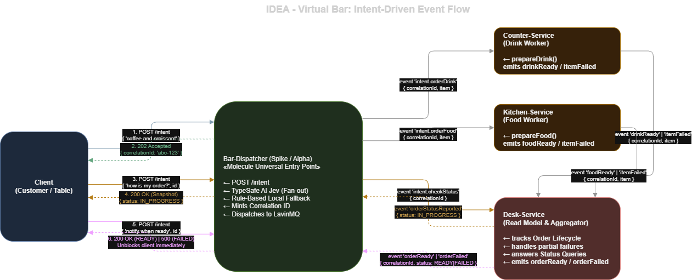

# ☕ IDEA - Intent Driven Event Architecture (Virtual Bar)


[](https://openjdk.org/)
[](https://spring.io/projects/spring-boot)
[](https://lavinmq.com/)
[](https://api.typesafe.ai)
[](http://localhost:8080)
[](https://opensource.org/licenses/MIT)

> **"One microservice = One business intent"**  
> An exploratory Proof-of-Concept and reference laboratory investigating intent-first routing, compound fan-out, and closed-loop observability across event-driven microservices.

---

## 📖 Architectural Exploration & Scope

This repository provides an experimental reference implementation exploring the architectural hypothesis formulated by [Giuseppe Vincenzi](https://www.linkedin.com/in/giuseppevincenzi/) (IT Process Architect) in:  
👉 **[Intent-Driven Architecture: a microservice molecule driven by Business and Events](https://www.linkedin.com/pulse/intent-driven-architecture-microservice-molecule-driven-vincenzi-jzdhe/)**

### The Core Question
In distributed architectures, microservices are traditionally exposed via fragmented, resource-oriented endpoints (`/orders`, `/items`, `/payments`), leaving workflow orchestration to the client or heavy orchestrators.  
This project investigates an alternative question:  
*Can we treat natural language business intent as the sole public gateway of a microservice molecule, while keeping the resulting asynchronous workflows deterministic, observable, resilient to partial failures, and measurable in production?*

The architecture synthesizes **Domain-Driven Design (DDD)**, **Event-Driven Architecture (EDA)**, and **CQRS** around **three foundational pillars**:

1. **The Asynchronous Intent Distributor (The Spike / Alpha)**: A qualified single entry point that ingests natural language, evaluates business intents with low-latency classification (via TypeSafe AI Jev speculative fan-out or deterministic rule-based fallback), and dispatches discrete events to the broker.
2. **End-to-End Correlation ID**: Every intent lifecycle is minted with a unique identifier that travels through every downstream queue, worker, and return event.
3. **Observability & Closed-Loop Feedback**: A dedicated read-model service (`Desk-Service`) that tracks intermediate states, manages partial failures, and emits completion events to close the feedback loop.

### Scope & Boundaries
This project is an **architectural prototype and didactic laboratory**, designed to demonstrate structural interaction patterns with minimal accidental complexity. Enterprise concerns such as distributed tracing (OpenTelemetry), edge security (OAuth2/OIDC gateways), and persistent event stores are discussed as architectural extension points.

---

## 🖥️ Live Observability Console (Interactive UI)

The Dispatcher serves an embedded, zero-dependency **Live Observability Console** directly at `http://localhost:8080/`. Built using modern Vanilla JavaScript, it visually demonstrates the distributed lifecycle in real time:

- **Command Ingestion**: Ingests compound natural language requests (English or Italian).
- **Live Worker Telemetry**: Dedicated visual cards for **Bar-Counter** (Drink Worker) and **Bar-Kitchen** (Food Worker) showing live state transitions (`IDLE` $\rightarrow$ `WORKING` $\rightarrow$ `READY` or `FAILED`).
- **Real-Time Differential Execution**: Visually demonstrates how the Counter finishes in ~2.0s while the Kitchen finishes in ~3.0s, holding the terminal completion until both workers complete.
- **Speculative Error Injection**: Pre-configured buttons to simulate out-of-stock scenarios (e.g. champagne or caviar) and witness immediate failure unblocking.

---

## 🏛️ The Architectural Triad: Three Core Interaction Patterns

Rather than exposing fragmented, resource-oriented REST endpoints (`/orders`, `/status`, `/wait`), the entire molecule exposes a **single universal entry point (`POST /intent`)**. 

Depending on the classified intent, the gateway dynamically activates one of the **three foundational patterns of modern distributed systems**:

```
                       POST /intent
                            │
               ┌────────────┴────────────┐
               │  IntentClassifier Router│ (Jev AI + Local Fallback)
               └────────────┬────────────┘
                            │
       ┌────────────────────┼────────────────────┐
       ▼                    ▼                    ▼
[ 1. Write-Path ]    [ 2. Read-Path ]     [ 3. Reactive-Path ]
  Async Fire & Forget  Snapshot Point-in-Time Long-Poll Event Stream
  (ORDER_DRINK / FOOD) (CHECK_STATUS)         (AWAIT_READY)
  ↳ 202 Accepted       ↳ 200 OK (State Snapshot) ↳ 200 OK (On Completion)
                                                 ↳ 500 (On Failure)
```

1. **Asynchronous Command / Write-Path (`ORDER_DRINK`, `ORDER_FOOD`)**:
   - Dispatches work to the responsible worker microservices (`Counter` or `Kitchen`).
   - Non-blocking: returns `202 Accepted` immediately with the minted `correlationId`.
   - Supports **Speculative Fan-out**: compound requests like *"I'd like a cappuccino and a croissant"* emit multiple events in parallel under the same `correlationId`.
2. **Point-in-Time Snapshot Query / Read-Path (`CHECK_STATUS`)**:
   - Queries the aggregated materialized view in the `Desk-Service`.
   - Returns an immediate snapshot of the order's internal progression.
3. **Reactive Long-Poll / Completion Notification (`AWAIT_READY`)**:
   - Executes a non-blocking pre-flight check to verify if the order is already in a terminal state (`READY` or `FAILED`).
   - If in progress, suspends the incoming HTTP connection using Spring MVC `DeferredResult`.
   - Unblocks reactively when the `Desk-Service` evaluates that *all* items have completed (`OrderReadyEvent`) or when an item fails (`OrderFailedEvent`).

---

## 🔍 Pure Observability: Why Both `CHECK_STATUS` and `AWAIT_READY` Matter

A common architectural trap in distributed systems is conflating **state inspection** with **completion notification**. This project intentionally decouples them to achieve **Pure Observability**:

| Dimension | `CHECK_STATUS` (Snapshot Inspection) | `AWAIT_READY` (State-Transition Push) |
|---|---|---|
| **Nature** | **Synchronous / Instantaneous** (~5ms) | **Reactive / Suspended** (1s to 30s) |
| **Semantic Question** | *"What is happening inside the molecule right now?"* | *"Notify me the exact instant everything is done."* |
| **Domain State** | Inspects intermediate states (`IN_PROGRESS`, item-by-item breakdown) | Awaits terminal transition (`READY` or `FAILED`) |
| **Resilience & Diagnostics** | Essential when an await times out, allowing operators or users to diagnose partial failures or bottlenecks. | Provides smooth, zero-polling client UX without burning CPU or network bandwidth. |

By supporting both through natural language, the architecture ensures that the system is **transparent and inspectable at every stage of the lifecycle**, directly answering the question of observability and controllability in distributed environments.

---

## 🛡️ Distributed Consistency & Production Guarantees

Distributed systems cannot rely on naive assumptions such as ordered message arrivals, crash-free instances, or network synchrony:

### 1. Monotonic State Machine & Out-of-Order Delivery
In real-world networks, a completion event (`event.drinkReady`) may arrive at the `Desk-Service` *before* the intent event (`intent.orderDrink`) due to thread preemption or network jitter.  
- The `ItemState` enumeration defines a **strictly monotonic state machine** via `canTransitionTo(...)`.
- The `Order` aggregate uses atomic `compute()` operations: if an item reaches `READY` ahead of time, a lagging `ORDERED` intent **never regresses the state**.
- State keys are strongly typed and composited via `IntentEnum`: `IntentEnum.name() + ":" + correlationId`.

### 2. Idempotency on At-Least-Once Delivery
AMQP brokers guarantee at-least-once message delivery. Receiving duplicate events must not corrupt business aggregates:
- `Order.recordItemReady(...)` updates item state idempotently through atomic map computations.
- Duplicate completion events for an intent already marked `READY` produce no state mutation or side effects.

### 3. Knowing When an Order Is Truly Complete
The `Desk-Service` binds to explicit order intent routing keys (`intent.orderDrink`, `intent.orderFood`) to register expected items in the lifecycle tracker upon intent ingestion.  
When evaluations occur, `checkOrderReady()` evaluates all registered lines: an order only transitions from `IN_PROGRESS` to `READY` when **every declared intent** satisfies the `READY` predicate and no intent is in `FAILED`.

### 4. Persistence & State Storage Boundaries
To keep this laboratory lightweight and runnable in under 30 seconds without external database setup, order aggregates are backed by a thread-safe in-memory store (`ConcurrentHashMap`).  
In an enterprise deployment, this repository is replaced by an **Event Sourced store** or a distributed document database (PostgreSQL / MongoDB) keyed on the `correlationId`.

### 5. Horizontal Scalability of Reactive Long-Polls
In a multi-instance deployment of `bar-dispatcher` behind a load balancer, client connections are held on specific pods.  
To deliver `OrderReadyEvent` to the exact pod holding the `DeferredResult`, the production topology uses a **Fanout Exchange** (or Redis Pub/Sub) across dispatcher instances, or assigns **pod-exclusive anonymous queues** bound to the correlation exchange. The current single-replica setup demonstrates the end-to-end event bridge cleanly while remaining horizontally extensible.

---

## 🛡️ Resilience, Fallback & Partial Failure Handling

Real-world distributed systems encounter partial failures and third-party downtime. The architecture addresses both systematically:

### 1. Intent Classification Graceful Degradation (Zero Lock-In)
The `Bar-Dispatcher` decouples classification behind the `IntentClassifier` interface:
- **Primary Engine (`JevIntentClassifier`)**: Uses TypeSafe AI's Jev model for speculative fan-out.
- **Deterministic Fallback (`RuleBasedIntentClassifier`)**: An in-memory regex engine. Activated automatically if the remote API fails, times out, or when running offline without credentials (`JEV_ENABLED=false`).

### 2. Partial Failure Handling
- If a worker cannot complete an item, it emits an `ItemFailedEvent` carrying the typed `failedIntent`.
- The `Desk-Service` intercepts this event, marks the intent as `FAILED`, transitions the order status to `FAILED`, and emits an `OrderFailedEvent`.
- The Dispatcher's `ResponseTrackerService` captures `OrderFailedEvent` and **immediately completes the pending `AWAIT_READY` request with an error**, rather than waiting for the 30-second timeout.
- The `Order` aggregate supports self-healing: if a failed item is reprocessed or retried, receiving a subsequent ready event transitions the item back to `READY`.

### 3. AMQP Dead Lettering
A dedicated Dead Letter Exchange (`bar.dlx`) and queue (`q.bar.dead-letter`) capture poison-pill messages or unroutable payloads, protecting worker processing loops.

---

## ☕ The Domain: Virtual Bar

The architecture models a **Virtual Bar** with a single universal entry point and specialized workers:



### The Universal Entry Point (`POST /intent`)

Clients interact exclusively through `POST /intent`. Jev classifies the request into one or more business intents via speculative fan-out:

| Business Intent (`IntentEnum`) | Target Worker | LavinMQ Routing Key | Behavior |
|---|---|---|---|
| **`ORDER_DRINK`** | `Counter-Service` | `intent.orderDrink` | Asynchronous (`202 Accepted`) |
| **`ORDER_FOOD`** | `Kitchen-Service` | `intent.orderFood` | Asynchronous (`202 Accepted`) |
| **`CHECK_STATUS`** | `Desk-Service` | `intent.checkStatus` | Synchronous snapshot via Correlation ID |
| **`AWAIT_READY`** | `Desk-Service` | `event.orderReady` (listener) | Reactive long-poll via `DeferredResult` |

---

## 📡 AMQP Topology & Message Flow (LavinMQ)

All inter-service communication flows through a single **Topic Exchange** named **`bar.exchange`**. Microservices never call each other directly; they only bind their dedicated queues using specific routing keys or wildcard patterns.

```
                           ┌────────────────────────────────────────┐
                           │       TOPIC EXCHANGE: bar.exchange     │
                           └─┬──────────────┬──────────────┬──────┬─┘
                             │              │              │      │
          intent.orderDrink  │              │              │      │ event.orderReady
         ────────────────────┘              │              │      │ event.orderFailed
        │                 intent.orderFood  │              │      └────────────────────┐
        │                ───────────────────┘              │ intent.checkStatus        │
        │               │                     event.*      │                           │
        │               │               intent.orderDrink  │                           │
        │               │               intent.orderFood   │                           │
        ▼               ▼              ────────────────────┘                           ▼
┌──────────────┐ ┌──────────────┐    ┌───────────────────────────┐         ┌───────────────────────────┐
│q.counter.    │ │ q.kitchen.   │    │      q.desk.events        │         │   q.dispatcher.responses  │
│   drinks     │ │    food      │    │ (Order Lifecycle Tracker) │         │ (Unblocks Waiting HTTP)   │
└───────┬──────┘ └──────┬───────┘    └─────────────┬─────────────┘         └─────────────┬─────────────┘
        │               │                          │                                     │
   Counter-Service Kitchen-Service                 │                                     │
        │               │                          ▼                                     ▼
        │ drinkReady    │ foodReady        Desk-Service (Read Model)               Bar-Dispatcher
        │ itemFailed    │ itemFailed               │                                 (The Spike)
         ───────────────┴──────────────────────────┘
```

### Complete Routing & Binding Matrix

| Publisher | Routing Key | Target Queue | Consumer | Semantic Payload / Event |
|---|---|---|---|---|
| **Dispatcher** | `intent.orderDrink` | `q.counter.drinks` | `bar-counter` | `OrderDrinkIntentEvent` (item text, correlationId) |
| **Dispatcher** | `intent.orderFood` | `q.kitchen.food` | `bar-kitchen` | `OrderFoodIntentEvent` (item text, correlationId) |
| **Dispatcher** | `intent.orderDrink` | `q.desk.events` | `bar-desk` | Registers drink intent as `ORDERED` in the lifecycle tracker |
| **Dispatcher** | `intent.orderFood` | `q.desk.events` | `bar-desk` | Registers food intent as `ORDERED` in the lifecycle tracker |
| **Counter** | `event.drinkReady` | `q.desk.events` | `bar-desk` | `DrinkReadyEvent` (marks drink intent `READY`) |
| **Kitchen** | `event.foodReady` | `q.desk.events` | `bar-desk` | `FoodReadyEvent` (marks food intent `READY`) |
| **Any Worker** | `event.itemFailed` | `q.desk.events` | `bar-desk` | `ItemFailedEvent` (marks intent `FAILED`, carries `failedIntent`) |
| **Dispatcher** | `intent.checkStatus` | `q.desk.queries` | `bar-desk` | `CheckStatusIntentEvent` (correlationId) |
| **Desk** | `event.orderStatusReported` | `q.dispatcher.responses` | `bar-dispatcher` | `OrderStatusReportedEvent` (aggregates intent states) |
| **Desk** | `event.orderReady` | `q.dispatcher.responses` | `bar-dispatcher` | `OrderReadyEvent` (unblocks pending `AWAIT_READY` on success) |
| **Desk** | `event.orderFailed` | `q.dispatcher.responses` | `bar-dispatcher` | `OrderFailedEvent` (unblocks pending `AWAIT_READY` on failure) |

---

## 🧩 Molecule Structure (Maven Modules)

The repository is organized as a multi-module Maven project (`com.gist:idea-virtual-bar:1.0.0`):

| Module | Architectural Role | Description |
|---|---|---|
| **`bar-common`** | **Contracts & Kernel** | Shared immutable Java records for domain events (`DomainEvent`), `IntentEnum`, and AMQP topology definitions (`AmqpTopology`). |
| **`bar-dispatcher`** | **The Spike (Alpha)** | The sole public entry point (`POST /intent`) and host of the **Live UI Console**. Classifies intents via Jev AI or local rule fallback, assigns `correlationId`, and publishes to LavinMQ. |
| **`bar-counter`** | **Drink Worker** | Consumes `intent.orderDrink`, simulates preparation, and publishes `drinkReady` or `itemFailed`. |
| **`bar-kitchen`** | **Food Worker** | Consumes `intent.orderFood`, simulates preparation, and publishes `foodReady` or `itemFailed`. |
| **`bar-desk`** | **Read Model & Aggregator**| Tracks intent states, answers status queries, and publishes completion/failure events when order state transitions. |

---

## 🧠 Intent Classification with TypeSafe AI Jev

Rather than using a slow generative LLM, the Dispatcher integrates **TypeSafe AI's Jev**—a specialized System One decision model:

- **Ultra-Low Latency (70–200ms)**: Fast, deterministic classification without free-text generation.
- **Speculative Fan-Out**: Evaluates multiple choice questions (`order_drink`, `order_food`, `check_status`, `await_ready`) concurrently in a single HTTP request.
- **Confidence Safety Gating**: Rejects ambiguous inputs below the confidence threshold (`0.65`) before publishing any events.
- **Zero Third-Party SDK Bloat**: Integrated cleanly via Spring Boot's native `RestClient` and Java records.

---

## 🛠️ Technology Stack

- **Language & Runtime**: Java 21 LTS (Generational ZGC enabled)
- **Framework**: Spring Boot 3.5.5
- **Message Broker**: [LavinMQ](https://lavinmq.com/) (AMQP 0-9-1 cloud instance or local container)
- **Primary Intent Classifier**: [TypeSafe AI Jev (System One Model)](https://api.typesafe.ai)
- **Fallback Classifier**: In-memory deterministic regex rule engine
- **HTTP Client**: Spring Boot `RestClient`
- **Async Web**: Spring MVC `DeferredResult`
- **User Interface**: Lightweight HTML5 & Vanilla JavaScript (Embedded Live Telemetry Console)
- **Build Tool**: Maven

---

## 🚀 Prerequisites & Quickstart

### 1. Prerequisites
- **JDK 21 LTS** installed and configured (`java -version`).
- Maven 3.9+.
- Docker installed (for local LavinMQ broker).

### 2. Clone the repository
```bash
git clone https://github.com/gvincenzi/idea-virtual-bar.git
cd idea-virtual-bar
```

### 3. Start local LavinMQ broker
```bash
docker compose up -d lavinmq
```
LavinMQ Management UI is accessible at `http://localhost:15672` (credentials: `guest` / `guest`).

### 4. Build the project
```bash
mvn clean install
```

### 5. Run the services
The services default to `localhost:5672` and run offline with the deterministic rule-based engine out-of-the-box (no API key required):
```bash
java -jar bar-dispatcher/target/bar-dispatcher-1.0.0.jar
java -jar bar-desk/target/bar-desk-1.0.0.jar
java -jar bar-counter/target/bar-counter-1.0.0.jar
java -jar bar-kitchen/target/bar-kitchen-1.0.0.jar
```

To run with TypeSafe AI Jev enabled, simply export:
```bash
export JEV_ENABLED=true
export JEV_API_KEY="your-typesafe-jev-api-key"
```

### 6. Open the Live Observability Console
Open your browser and navigate to:  
👉 **`http://localhost:8080/`**

Use the quick action buttons to dispatch compound orders, inspect telemetry, or trigger intentional failures.

---

## 🧪 Testing via CLI / cURL

### 1. Compound Order (Write-Path Fan-out)
```bash
curl -X POST http://localhost:8080/intent -H "Content-Type: application/json" -d "{\"message\": \"I would like a cappuccino and a croissant\"}"
```
**Response (`202 Accepted`)**:
```json
{
  "correlationId": "3fa85f64-5717-4562-b3fc-2c963f66afa6",
  "status": "RECEIVED",
  "dispatchedIntents": ["ORDER_DRINK", "ORDER_FOOD"],
  "timestamp": "2026-09-28T14:30:00Z"
}
```

### 2. Point-in-Time Snapshot (Read-Path)
```bash
curl -X POST http://localhost:8080/intent -H "Content-Type: application/json" -d "{\"message\": \"What is the status of my order?\", \"correlationId\": \"YOUR-UUID\"}"
```
**Response (`200 OK`)**:
```json
{
  "correlationId": "3fa85f64-5717-4562-b3fc-2c963f66afa6",
  "status": "IN_PROGRESS",
  "items": {
    "ORDER_DRINK:3fa85f64-5717-4562-b3fc-2c963f66afa6": "READY",
    "ORDER_FOOD:3fa85f64-5717-4562-b3fc-2c963f66afa6": "ORDERED"
  },
  "timestamp": "2026-09-28T14:30:02Z"
}
```

### 3. Reactive Completion Notification (Long-Poll Stream)
```bash
curl -X POST http://localhost:8080/intent -H "Content-Type: application/json" -d "{\"message\": \"Please notify me when everything is ready\", \"correlationId\": \"YOUR-UUID\"}"
```
*(The HTTP connection waits non-blockingly until all workers complete, returning the unified schema)*:  
**Response (`200 OK`)**:
```json
{
  "correlationId": "3fa85f64-5717-4562-b3fc-2c963f66afa6",
  "status": "READY",
  "items": {
    "ORDER_DRINK:3fa85f64-5717-4562-b3fc-2c963f66afa6": "READY",
    "ORDER_FOOD:3fa85f64-5717-4562-b3fc-2c963f66afa6": "READY"
  },
  "timestamp": "2026-09-28T14:30:04Z"
}
```

---

## 👤 Author

**Giuseppe Vincenzi**
- LinkedIn: [@giuseppevincenzi](https://www.linkedin.com/in/giuseppevincenzi/)
- Reference article: [Intent-Driven Architecture: a microservice molecule driven by Business and Events](https://www.linkedin.com/pulse/intent-driven-architecture-microservice-molecule-driven-vincenzi-jzdhe/)

---

## 📄 License

Distributed under the MIT License. See `LICENSE` for details.